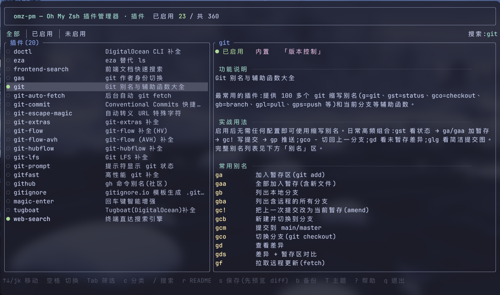
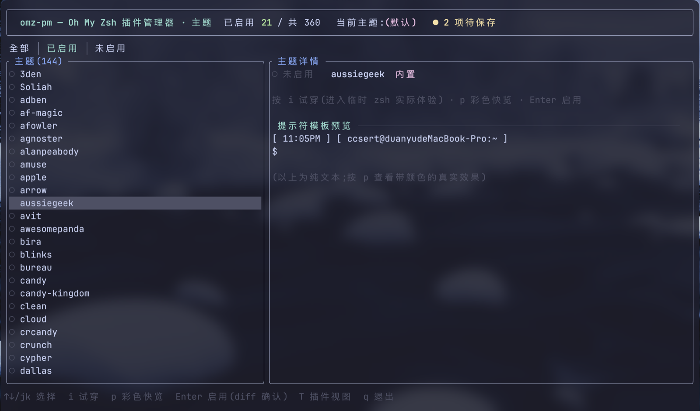
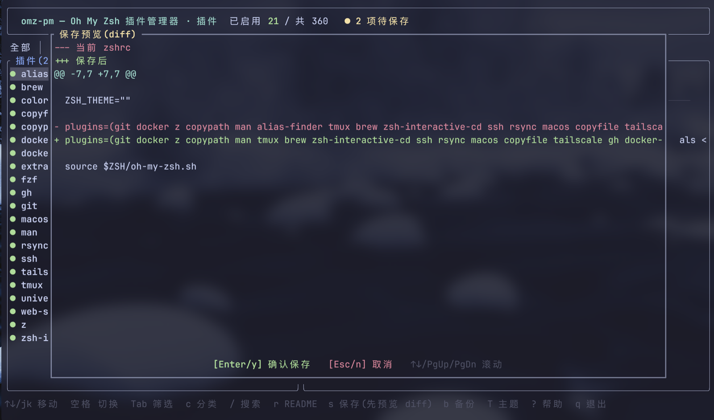
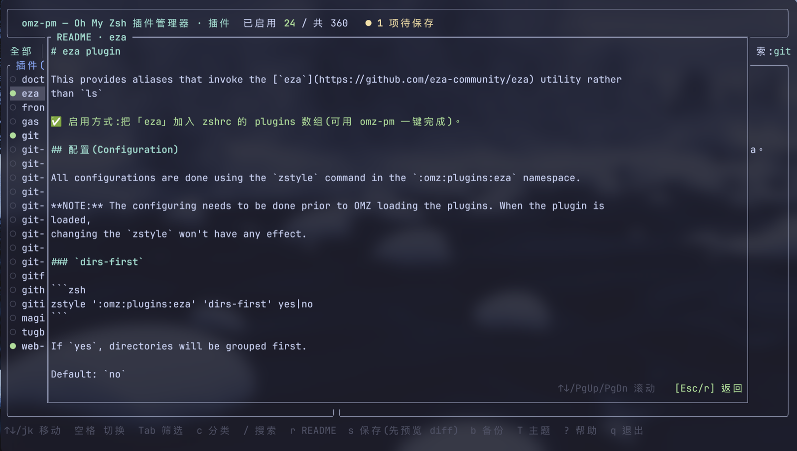

<div align="center">

# omz-pm

**A TUI plugin & theme manager for Oh My Zsh — with a built-in Chinese dictionary.**

Browse all 360+ built-in plugins, read what they *actually do* (in Chinese or English),
toggle them with a single keypress, preview & try-on themes live — all without ever
hand-editing `~/.zshrc`.

[](https://github.com/ccsert/omz-pm/actions/workflows/ci.yml)
[](https://github.com/ccsert/omz-pm/releases)
[](LICENSE)
[](https://www.rust-lang.org)

[English](README.md) | [简体中文](README.zh-CN.md)



</div>

## Why

Oh My Zsh ships **359 plugins and 144 themes**, but discovering them means scrolling
through a giant English wiki page, guessing what `zsh-navigation-tools` does, and
hand-editing `plugins=(...)` in your zshrc.

omz-pm puts all of that in a terminal UI:

- **See everything** — plugins *and* themes, enabled state at a glance
- **Understand everything** — every plugin ships with a curated Chinese summary,
  practical usage guide, and annotated aliases; every README comes fully
  translated, one keypress away
- **Change safely** — diff preview before every write, timestamped backups, one-command rollback

## Features

### 🔌 Plugin management

| | |
| --- | --- |
| **Browse & search** | All built-in + custom plugins, with live search (names, Chinese descriptions, categories, aliases — type `gst` to jump to the git plugin) and 18 category filters |
| **Toggle & save** | `Space` to stage enable/disable changes, `s` to preview a diff, `Enter` to write — atomic, always backed up |
| **Chinese dictionary** | 359 curated entries baked into the binary: summary, usage guide, and annotated aliases for every plugin |
| **Alias index** | Aliases are extracted from each plugin's source code — works for custom plugins too |
| **Ghost cleanup** | Plugins still listed in `plugins=(…)` but missing on disk are flagged in the header, listed via `x`, and removed through the same diff-confirm-backup pipeline (`omz-pm list` warns about them too) |
| **README reader** | Read any plugin's README in-TUI with markdown rendered (aligned tables, styled headings, links, code blocks) — all 359 built-in plugins ship with a complete curated Chinese translation; custom plugins fall back to light on-the-fly localization |

### 🎨 Theme management (`T`)

| | |
| --- | --- |
| **Browse** | All 144 built-in themes + `$ZSH_CUSTOM/themes`, current theme highlighted |
| **Preview** | Right panel renders the theme's real prompt via `print -P`; `p` flashes it in true color |
| **Try-on** | `i` spawns a full interactive zsh with the theme applied — exit to come back |
| **Enable** | `Enter` rewrites `ZSH_THEME=` through the same diff-confirm-backup pipeline |

### 🛟 Safety net

- Every write: **diff preview → confirm → timestamped backup → temp file + atomic rename**
- `b` opens the backup browser; restoring snapshots your current zshrc first, so rollback is always possible
- Parser handles single/multi-line arrays, `plugins+=`, inline comments, quoting, `$var` entries —
  everything else in your zshrc is preserved byte-for-byte

### ⏱️ Benchmarks

`omz-pm bench` times each enabled plugin in an isolated zsh (median of N runs, warm-up excluded)
so you can see exactly what's slowing your startup down. Press `B` in the TUI to run the same
analysis without leaving it (live progress plus a per-plugin time distribution).

## Screenshots

| Themes (live preview) | Save with diff preview |
| --- | --- |
|  |  |

| README reader (rendered markdown, full Chinese translation) | — |
| --- | --- |
|  | |

## Install

**One-liner** (recommended — detects your platform, downloads the prebuilt binary, verifies its SHA-256, installs to `~/.local/bin`):

```bash
curl -fsSL https://raw.githubusercontent.com/ccsert/omz-pm/main/install.sh | bash
```

**In China** — same script with `--cn`: GitHub downloads go through a mirror prefix, and source builds pull crates from rsproxy:

```bash
curl -fsSL https://ghfast.top/https://raw.githubusercontent.com/ccsert/omz-pm/main/install.sh | bash -s -- --cn
```

Public proxies occasionally go down — swap in your own via `OMZ_PM_MIRROR=<prefix>`. The installer is the only thing that touches the network; the tool itself phones home to no one.

**From source** (needs Rust 1.81+):

```bash
cargo install --git https://github.com/ccsert/omz-pm
# or clone + ./install.sh to also symlink into ~/.local/bin (--cn routes cargo through rsproxy)
```

**Manual**: grab a tarball from [Releases](https://github.com/ccsert/omz-pm/releases)
(`aarch64/x86_64` × `macOS/Linux`), untar, put `omz-pm` on your `PATH`.

The installer supports more: `--version <tag>` to pin, `--build` to force a source build, `--uninstall` — see `./install.sh --help`.

Requirements: `zsh` + Oh My Zsh. That's it — the dictionary is compiled in, nothing is fetched at runtime.

## Usage

```bash
omz-pm            # TUI (default)
omz-pm bench      # which plugins slow down your startup?
```

### Key bindings

| Key | Action |
| --- | --- |
| `↑↓` / `j k` | Move |
| `Space` / `Enter` | Toggle enable ↔ disable |
| `Tab` / `Shift+Tab` | Filter: all → enabled → disabled |
| `c` / `C` | Cycle 18 category filters |
| `/` | Search (names, Chinese text, categories, aliases) |
| `r` | Read plugin README (full Chinese translation) |
| `s` | Save — opens diff preview first |
| `b` | Backup browser & restore |
| `B` | Bench enabled plugins' load time without leaving the TUI |
| `x` | Detect & clean up ghost plugins (enabled in zshrc, missing on disk) |
| `T` | Switch plugin ↔ theme view |
| `i` / `p` | (themes) try-on in a live zsh / flash colored preview |
| `?` / `q` | Help / quit |

### CLI

```bash
omz-pm list [--enabled|--disabled]  # plugin inventory
omz-pm info <name>                  # description + usage guide + annotated aliases
omz-pm which <alias>                # gco ← git plugin: git checkout
omz-pm aliases <name>               # every alias a plugin defines
omz-pm readme <name>                # print the fully translated README
omz-pm themes                       # list themes
omz-pm theme <name>                 # enable a theme (diff-confirmed)
omz-pm theme --preview <name>       # render its prompt in color
omz-pm bench [--runs N] [--all]     # load-time analysis
omz-pm backups [--clean --keep N]   # backup management
omz-pm restore <index|path>         # roll back
omz-pm enable/disable <name>...     # scriptable enable/disable
```

`--zshrc <path>` works everywhere for testing or non-default setups.

## Customizing translations

The Chinese dictionary can be overridden without recompiling — drop entries into
`~/.config/omz-pm/translations.json` (fields: `summary`, `detail`, `cat`, `usage`, `aliases`).
This is also the place to document your own custom plugins:

```json
{
  "my-plugin": {
    "summary": "Does one thing well",
    "usage": "Press Ctrl+K to ...",
    "aliases": {"mp": "what it means"}
  }
}
```

Full-README translations work the same way: put a file at
`~/.config/omz-pm/readmes-zh/<plugin>.md` to override the built-in translation,
or to give your own custom plugin a Chinese README.

The usage corpus lives in `tools/usage/<issue#>-<category>.json`, one file per
category — edit and re-run `tools/enrich_translations.py` to regenerate;
`--check-sources` verifies every alias against the plugin source.
`tools/build_readme_bundle.py` validates `data/readmes-zh/` (one curated Chinese
translation per plugin, style guide in `docs/readme-translation-guide.md`) and packs
it into the compile-time `data/readmes_zh.json`.

## How it works

```
$ZSH/plugins/*          ─┐
$ZSH_CUSTOM/plugins/*   ─┤→ scanner → ┌ TUI (ratatui) ─┐
~/.zshrc                ─┤            │ CLI subcommands│
data/translations.json  ─┘ (baked in) └────────────────┘
                                   │
                        diff → backup → atomic write
```

## Development

```bash
cargo test      # 80 unit tests (zshrc round-trips, alias parser, diff, dictionary, README bundle, layout)
cargo clippy    # zero warnings
```

The usage corpus is complete (359/359). Found an inaccuracy? Edit the category
JSON under `tools/usage/`, re-run `python3 tools/enrich_translations.py`, and send a PR.

## License

[MIT](LICENSE) © ccsert
