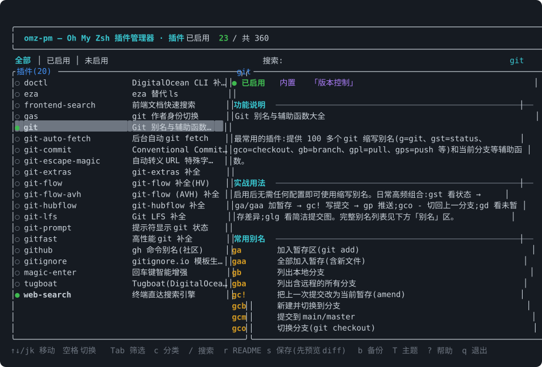
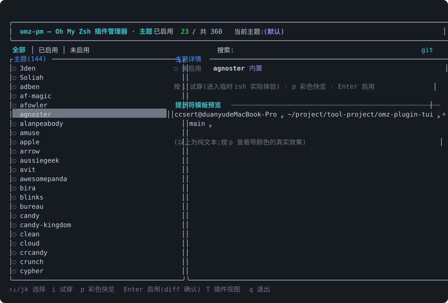
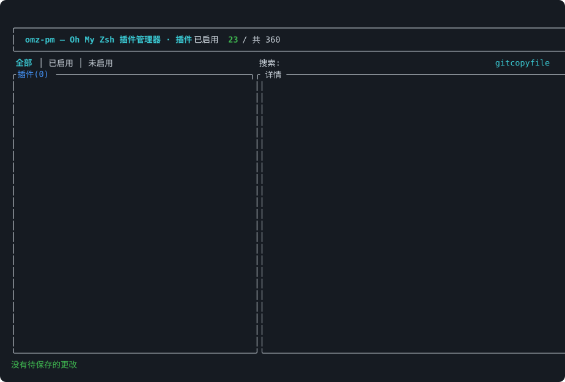

<div align="center">

# omz-pm

**Oh My Zsh 的插件与主题管理 TUI —— 内置 359 条中文说明词典。**

浏览全部 360+ 个内置插件、搞清楚它们到底能干什么、一键启用/禁用、实时预览与试穿主题,
全程不用手改 `~/.zshrc`。

[](https://github.com/ccsert/omz-pm/actions/workflows/ci.yml)
[](https://github.com/ccsert/omz-pm/releases)
[](LICENSE)
[](https://www.rust-lang.org)

[English](README.md) | [简体中文](README.zh-CN.md)



</div>

## 为什么做这个

Oh My Zsh 自带 **359 个插件、144 个主题**,但想发现它们只能翻一大页英文 wiki,猜
`zsh-navigation-tools` 是干嘛的,再手改 zshrc 里的 `plugins=(...)`。

omz-pm 把这些全部搬进终端界面:

- **看得全** —— 插件和主题一屏浏览,启用状态一目了然
- **看得懂** —— 每个插件都有中文简介;48 个常用插件带实战用法指南和别名中文注解;README 一键阅读(标题汉化)
- **改得放心** —— 每次写入前 diff 预览,自动时间戳备份,一条命令回滚

## 功能

### 🔌 插件管理

| | |
| --- | --- |
| **浏览与搜索** | 全部内置 + 自定义插件;搜索支持名称、中文关键词、分类;18 个分类筛选 |
| **切换与保存** | `空格` 暂存启停变更,`s` 预览 diff,`Enter` 写入 —— 原子写入,必定先备份 |
| **中文词典** | 359 条精编词典编译进二进制:简介 + 实战用法 + 常用别名中文注解 |
| **别名索引** | 别名直接从插件源码提取 —— 自定义插件同样适用 |
| **README 阅读器** | 在 TUI 里读任意插件 README:小节标题汉化、样板启用说明翻译、别名表格原样保留 |

### 🎨 主题管理(按 `T` 切换)

| | |
| --- | --- |
| **浏览** | 144 个内置主题 + `$ZSH_CUSTOM/themes`,当前主题高亮 |
| **预览** | 右侧面板用 `print -P` 渲染主题的真实提示符;按 `p` 在真实终端彩色快览 |
| **试穿** | 按 `i` 进入套用该主题的完整交互 zsh,`exit` 返回 |
| **启用** | `Enter` 走 diff 确认流程改写 `ZSH_THEME=` |

### 🛟 安全网

- 每次写入:**diff 预览 → 确认 → 时间戳备份 → 临时文件 + 原子 rename**
- 按 `b` 打开备份浏览器;恢复前会先把当前内容另存快照,恢复本身也可回滚
- 解析器支持单行/多行数组、`plugins+=`、行内注释、引号、`$var` —— zshrc 其余内容逐字保留

### ⏱️ 性能分析

`omz-pm bench` 在隔离 zsh 中逐个计时已启用插件(热身 1 次取中位),启动慢在哪里一眼可见。

## 截图

| 主题视图(实时预览) | diff 保存预览 |
| --- | --- |
|  |  |

| README 阅读器(标题汉化) | — |
| --- | --- |
|  | |

## 安装

**从源码安装**(需要 Rust 1.81+):

```bash
cargo install --git https://github.com/ccsert/omz-pm
# 或克隆后执行 ./install.sh,会额外软链到 ~/.local/bin
```

**预编译二进制**:到 [Releases](https://github.com/ccsert/omz-pm/releases) 下载对应平台
(aarch64/x86_64 × macOS/Linux),解压后把 `omz-pm` 放进 `PATH`。

依赖:zsh + Oh My Zsh。词典编译在二进制里,运行时不联网。

## 使用

```bash
omz-pm            # 进入 TUI(默认)
omz-pm bench      # 看看哪个插件拖慢了启动
```

### 快捷键

| 按键 | 功能 |
| --- | --- |
| `↑↓` / `j k` | 移动 |
| `空格` / `Enter` | 切换 启用 ↔ 禁用 |
| `Tab` / `Shift+Tab` | 筛选:全部 → 已启用 → 未启用 |
| `c` / `C` | 分类筛选循环(18 类) |
| `/` | 搜索(名称、中文说明、分类) |
| `r` | 阅读 README(标题汉化) |
| `s` | 保存 —— 先弹 diff 预览 |
| `b` | 备份管理与恢复 |
| `T` | 插件视图 ↔ 主题视图 |
| `i` / `p` | (主题)试穿 / 彩色快览 |
| `?` / `q` | 帮助 / 退出 |

### CLI 子命令

```bash
omz-pm list [--enabled|--disabled]  # 插件清单
omz-pm info <名称>                  # 说明 + 实战用法 + 别名注解
omz-pm which <别名>                 # gco ← git 插件:切换分支(git checkout)
omz-pm aliases <名称>               # 列出插件全部别名
omz-pm readme <名称>                # 输出翻译辅助后的 README
omz-pm themes                       # 主题清单
omz-pm theme <名称>                 # 启用主题(diff 确认)
omz-pm theme --preview <名称>       # 渲染主题提示符(带颜色)
omz-pm bench [--runs N] [--all]     # 加载耗时分析
omz-pm backups [--clean --keep N]   # 备份管理
omz-pm restore <序号|路径>          # 回滚
omz-pm enable/disable <名称>...     # 脚本化启停
```

所有子命令都支持 `--zshrc <路径>` 指定其他 zshrc。

## 自定义翻译

词典不用重新编译就能覆盖 —— 在 `~/.config/omz-pm/translations.json` 写同名条目
(字段:`summary` / `detail` / `cat` / `usage` / `aliases`)。给自己写的自定义插件补中文说明也在这里:

```json
{
  "my-plugin": {
    "summary": "一句话说明",
    "usage": "怎么用的说明",
    "aliases": {"mp": "缩写含义"}
  }
}
```

`tools/enrich_translations.py` 可离线重新生成内置词典(分类 + 实战用语料)。

## 开发

```bash
cargo test      # 50 个单元测试(zshrc 往返 / 别名解析 / diff / 词典 / 排版)
cargo clippy    # 零警告
```

欢迎贡献 —— 尤其是剩下约 300 个插件的实战用法语料
(编辑 `tools/enrich_translations.py` 后运行即可重新生成 `data/translations.json`)。

## 许可证

[MIT](LICENSE) © ccsert
